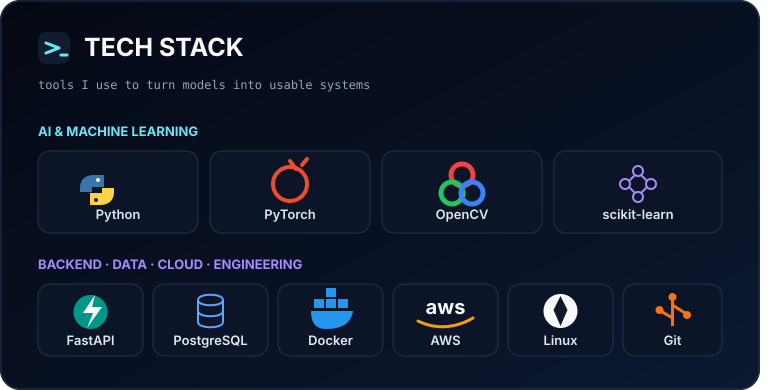

<div align="center">
  <a href="https://www.linkedin.com/in/ilke-%C3%B6z%C3%A7endek-b0404433b">
    
  </a>
</div>

<!-- V2 — dashboard-inspired profile. Replace every YOUR_* placeholder before publishing. -->

<table align="center" width="100%">
<tr>
<td width="64%" valign="top">
  
</td>
<td width="36%" valign="middle">
  <a href="https://github.com/IlkeOzcendek/Signify">
    
  </a>
  <br />
  <a href="https://github.com/IlkeOzcendek?tab=repositories">
    
  </a>
  <br />
  <a href="https://github.com/IlkeOzcendek?tab=overview">
    
  </a>
</td>
</tr>
</table>


## `~/expeditions` FEATURED PROJECTS

<table>
<tr>
<td width="50%" valign="top">

### 🟣 [Signify](https://github.com/IlkeOzcendek/Signify)

**Handwritten Signature Verification**

An end-to-end prototype using Siamese neural networks, contrastive loss, OpenCV preprocessing, multi-reference comparison, and a local persistence layer.

`Python` `PyTorch` `OpenCV` `Streamlit`  
`SQLite` `SQLAlchemy`

</td>
<td width="50%" valign="top">

### 🔵 AI Backend API

**Replaceable project slot**

A future home for a model-serving REST API with authentication, request validation, persistence, and containerized deployment.

`FastAPI` `Docker` `PostgreSQL`  
_Repository coming soon._

</td>
</tr>
<tr>
<td width="50%" valign="top">

### 🟢 AWS Cloud Project

**Replaceable project slot**

A placeholder for a serverless or cloud-native system. Update this card only after the project exists.

`AWS Lambda` `API Gateway` `S3`  
`DynamoDB` `Infrastructure as Code`  
_Repository coming soon._

</td>
<td width="50%" valign="top">

### 🟠 Machine Learning Playground

**Replaceable project slot**

A future collection of focused experiments, notebooks, model implementations, and documented learning projects.

`Python` `PyTorch` `scikit-learn`  
_Repository coming soon._

</td>
</tr>
</table>

## `git log --journey`

```text
TED University ───── Computer Engineering
       │
       ├──────────── Control Systems minor
       ├──────────── FlyRank · Backend AI Engineering Intern
       ├──────────── Microsoft AI Innovators · Incoming intern
       ├──────────── AWS Cloud Club · Vice President
       └──────────── Signify · Building the next island
```

## `git contributions --animate`

<!-- Appears after the workflow publishes the output branch for the first time. -->
<picture>
  <source media="(prefers-color-scheme: dark)" srcset="https://raw.githubusercontent.com/IlkeOzcendek/IlkeOzcendek/output/github-contribution-grid-snake-dark.svg" />
  <source media="(prefers-color-scheme: light)" srcset="https://raw.githubusercontent.com/IlkeOzcendek/IlkeOzcendek/output/github-contribution-grid-snake.svg" />
  
</picture>

<table>
<tr>
<td width="46%" valign="top">

> **“Build things people can actually use.”**
>
> Keep learning. Keep shipping.

</td>
<td width="54%" valign="top">

### LET'S CONNECT

Let’s talk about AI, backend engineering, cloud projects, or student developer communities.

[LinkedIn](https://www.linkedin.com/in/ilke-%C3%B6z%C3%A7endek-b0404433b) · [Email](mailto:ozcendekilke@gmail.com)  
[GitHub](https://github.com/IlkeOzcendek)

</td>
</tr>
</table>

<div align="center">
  <sub>🌊 Exploring practical AI—one reliable system at a time.</sub>
</div>
